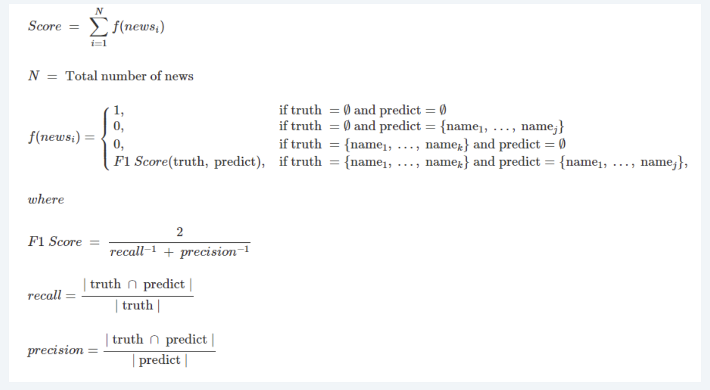
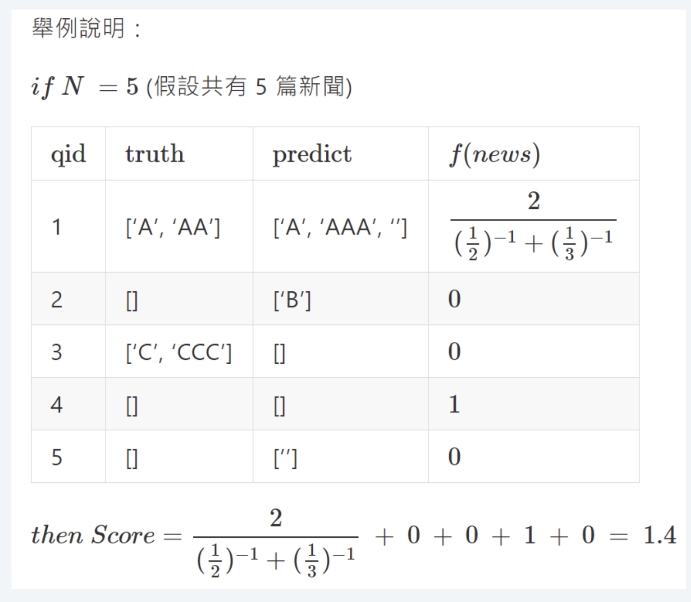

# E.Sun open AI competition 2020 - Gotcha! Everyone can be an AML expert!

## Competition description

Money laundering refers to the act of disguising and concealing criminal proceeds through various means to make them appear legal. In recent years, due to the frequent occurrence of international money laundering and terrorism financing events, as well as the increasing number of investment scams and telecom fraud cases, both the government and industries have devoted themselves to AML (Anti-Money Laundering) work.

Generally speaking, when customers interact with financial institutions, the banks need to immediately verify the customers' identity and check if they are on the AML watchlist by using an automated system. If AI can assist in updating the AML watchlist on a regular basis and coupled with automated comparison, it can significantly reduce the manpower and time cost of AML operations for banks.

In this [competition](https://tbrain.trendmicro.com.tw/Competitions/Details/11), participants will be provided with public news data links and corresponding watchlists. Through NLP algorithms, participants need to determine whether the content of the news article contains AML-related key figures, and extract the list of key figures (the list may be plural or empty). 

## Detailed tasks
1. The organizers will provide news links and a list of key people corresponding to each news article. Teams are required to implement a crawler program to retrieve the news content by themselves.
2. The participants need to train a natural language model to extract the list of key figures 
3. Participating teams must provide a RESTful API server and deploy their models on this API server, providing an API service for the "Online Model Accuracy Battle" in the form of an API service. The organizers will use HTTP request to verify the effectiveness of the participant's model with multiple daily rounds of questions, one question per round. 

## Competition result

Placed 29th (7%) out of 409 teams.

## Methodologies

1. Retrieve the names of people and their positions from the input.
2. Keep only the hundred most common surnames.
3. Handle vocabulary related to journalists.
4. Only guess people's names that are three characters long. (Normally, Taiwanese people's name are three characters long)
5. Identify the position of the keyword related to criminal topic. (Manually added by us)
6. Calculate the distance between the person's name and their position.
7. Use the distance to calculate other features.
8. Input features into pre-trained random forest model.
9. Output the results to a dataframe.

## Evaluation metrics

**Example**

## Useful links

- [Google Drive](https://drive.google.com/drive/folders/1Wjm3t6Yf2cCZveAa7QBhGy0t9xk-Hk3l?usp=share_link)